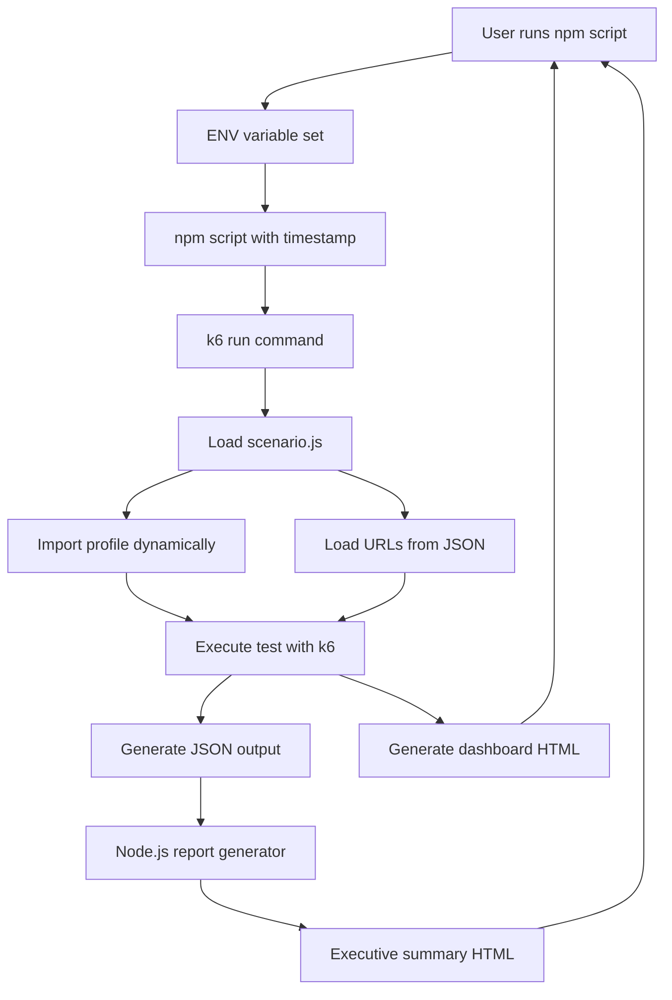
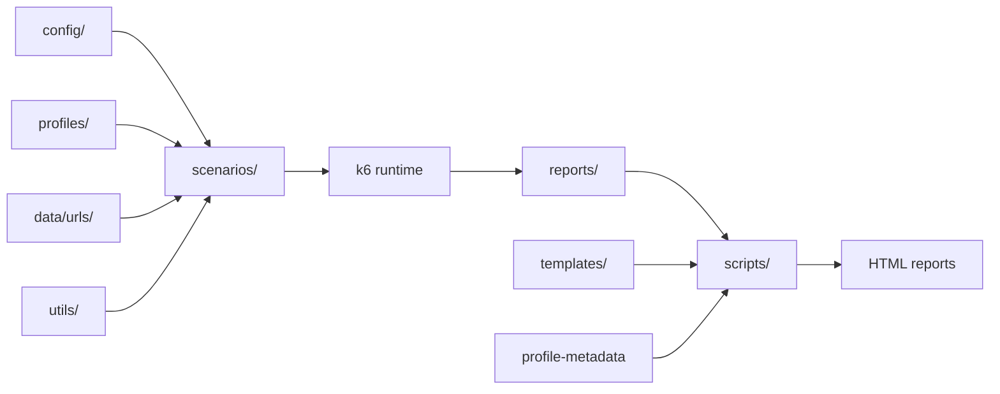
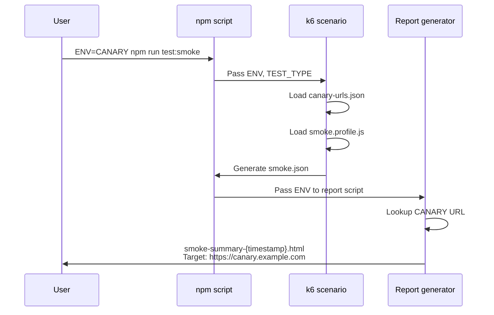
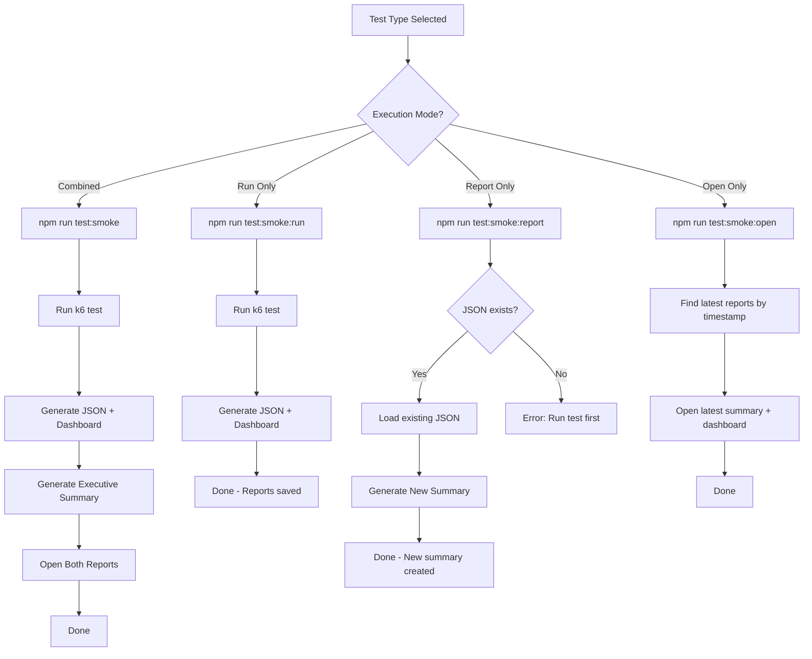

# K6 Load Testing Framework

A production-ready, modular k6 load testing framework with interactive HTML reporting. Test your applications under various load patterns to ensure reliability and performance.

---

## 🎯 What is This?

This framework helps you **simulate hundreds or thousands of users** visiting your website or API to answer questions like:

- **Can my site handle Black Friday traffic?**
- **What happens if 10,000 users visit simultaneously?**
- **Where is the breaking point?**
- **Are response times acceptable under load?**

### Non-Technical Summary

Think of this as a **traffic simulator** for websites:
- **Virtual Users (VUs)**: Simulated people using your site
- **Load Test**: Gradually increase traffic to see capacity
- **Stress Test**: Push beyond limits to find breaking points
- **Spike Test**: Simulate sudden traffic bursts (flash sales, viral events)
- **Soak Test**: Run for hours to find memory leaks

**Results:** Beautiful HTML reports with graphs showing response times, success rates, and system behavior under load.

---

## ✨ Features

- **🎨 Interactive HTML Reports** - Dashboard with graphs and metrics (like Allure for functional tests)
- **📊 Multiple Test Types** - Smoke, load, stress, spike, soak, and custom profiles
- **🌐 Browser & HTTP Modes** - Realistic browser testing or high-capacity HTTP testing
- **📁 JSON-Driven Configuration** - Store test URLs and data in JSON files
- **🔐 Authentication Support** - Cookie-based auth using Playwright pattern
- **🌍 Multi-Environment** - Support for preprod, staging, production
- **📈 Real-Time Dashboard** - Watch metrics live during test execution
- **🎯 Executive Summaries** - Non-technical reports for stakeholders

---

## 🚀 Quick Start (10 Minutes)

### Prerequisites

1. **Install k6**

```bash
# macOS
brew install k6

# Verify
k6 version
```

2. **Install Go** (required for HTML reports)

```bash
# macOS
brew install go

# Verify
go version
```

3. **Install npm dependencies**

```bash
cd k6-load-testing
npm install
```

### Build k6 with Dashboard Extension

```bash
# Install xk6 build tool
go install go.k6.io/xk6/cmd/xk6@latest

# Build custom k6 with dashboard
xk6 build --with github.com/grafana/xk6-dashboard@latest

# This creates ./k6 binary in project root
./k6 version
```

### Run Your First Test (Demo)

```bash
# Quick 1-minute smoke test on demo site
npm run demo:smoke

# Reports will open automatically:
# - Technical dashboard: reports/demo-smoke-20260201-120000.html
# - Executive summary: reports/demo-smoke-summary-20260201-120000.html
```

**What just happened:**
- ✅ 10 virtual users tested the demo site for 1 minute
- ✅ Measured response times, success rates, throughput
- ✅ Generated 2 timestamped reports: technical + executive summary
- ✅ JSON data saved for report regeneration

---

## 📁 Project Structure

```
k6-load-testing/
├── config/                          # Configuration files
│   ├── env.config.js               # Environment URL mappings
│   └── thresholds.config.js        # Pass/fail criteria
├── data/
│   └── urls/
│       ├── preprod-urls.json       # PREPROD environment URLs
│       ├── canary-urls.json        # CANARY environment URLs
│       ├── staging-urls.json       # STAGING environment URLs
│       ├── release-urls.json       # RELEASE environment URLs
│       ├── beta-urls.json          # BETA environment URLs
│       └── demo-urls.json          # Public demo URLs
├── profiles/                        # Load patterns (VUs, duration, stages)
│   ├── demo-*.profile.js           # 5-min demo profiles
│   ├── local.profile.js            # Local learning (2-10 VUs, 15 min)
│   ├── smoke.profile.js            # Quick validation (5-10 VUs, 1-2 min)
│   ├── load.profile.js             # Peak capacity (200-2400 VUs, 90 min)
│   ├── stress.profile.js           # Breaking point (500-3000 VUs, 60 min)
│   ├── spike.profile.js            # Traffic burst (100-2000 VUs, 15 min)
│   └── soak.profile.js             # Extended run (500 VUs, 4 hours)
├── scenarios/                       # Test logic
│   ├── browser/
│   │   └── page-load.scenario.js   # Browser-based testing (realistic)
│   ├── http/
│   │   └── api-endpoints.scenario.js  # HTTP-only (high capacity)
│   └── demo/
│       └── demo-*.scenario.js      # Public URL demos
├── scripts/
│   └── generate-executive-summary.js  # Non-tech report generator
├── templates/
│   └── executive-summary.html      # Report template
├── utils/                           # Reusable functions
│   ├── auth.utils.js               # Cookie/authentication
│   ├── metrics.utils.js            # Custom metrics
│   ├── helpers.utils.js            # Generic helpers
│   └── cookies-setup.js            # Cookie generator script
├── docs/
│   └── THEORY.md                   # K6 concepts explained
├── reports/                         # Generated HTML reports
└── k6                              # Custom k6 binary (built with xk6)
```

---

## 🏗️ Architecture & Data Flow

Understanding how the framework processes tests helps you customize and troubleshoot effectively.

### High-Level Execution Flow



**Key Points:**
- ⚙️ **Dynamic Loading**: Profiles and URLs loaded at runtime based on `ENV` and `TEST_TYPE` variables
- 📊 **Dual Output**: k6 generates technical dashboard + JSON, Node.js creates executive summary
- 🔄 **Modular**: Each step can run independently (`:run`, `:report`, `:open`)

---

### Component Architecture



**Component Responsibilities:**
- **config/**: Environment mappings, threshold definitions
- **profiles/**: Load patterns only (VUs, stages, duration)
- **scenarios/**: Test logic (what to test, how to validate)
- **data/urls/**: Environment-specific target URLs
- **utils/**: Reusable functions (auth, metrics, helpers)
- **scripts/**: Report generation and post-processing
- **templates/**: HTML templates for custom reports

---

### Environment Variable Flow

Shows how `ENV` variable determines which URLs to test and how reports are labeled:



**How It Works:**
1. **User sets ENV**: `ENV=CANARY` tells framework which environment to test
2. **Scenario loads URLs**: Automatically loads `data/urls/canary-urls.json`
3. **Test executes**: k6 tests URLs from loaded JSON file
4. **Report generator**: Reads `ENV` variable to populate target URL in summary
5. **Result**: Reports clearly show which environment was tested

**Without ENV:**
- Demo tests → Shows "Test Target" (generic)
- Production tests → Must specify ENV (no unsafe defaults)

---

### Complete Data Flow

From npm command to final reports:

```mermaid
graph TD
    CLI[CLI Command] --> ENV[ENV Variables]
    ENV --> TIMESTAMP[Generate Timestamp]
    TIMESTAMP --> K6Cmd[k6 run command]
    
    K6Cmd --> LoadScenario[Load scenario.js]
    LoadScenario --> ImportProfile[Import profile dynamically]
    LoadScenario --> LoadURL[Load URL JSON]
    LoadScenario --> ImportUtils[Import utils]
    
    ImportProfile --> Options[Build options object]
    LoadURL --> Options
    ImportUtils --> DefaultFunc[default function]
    
    Options --> K6Runtime[k6 runtime execution]
    DefaultFunc --> K6Runtime
    
    K6Runtime --> Metrics[Collect metrics]
    Metrics --> JSONWriter[Write JSON output]
    Metrics --> DashWriter[Write dashboard HTML]
    
    JSONWriter --> JSONFile[reports/smoke.json]
    DashWriter --> DashHTML[reports/smoke-{timestamp}.html]
    
    JSONFile --> NodeScript[Node.js report script]
    NodeScript --> ParseJSON[Parse NDJSON]
    ParseJSON --> CalcStats[Calculate statistics]
    CalcStats --> GenFindings[Generate 10 findings]
    GenFindings --> LoadTemplate[Load HTML template]
    LoadTemplate --> Populate[Populate placeholders]
    Populate --> SummaryHTML[reports/smoke-summary-{timestamp}.html]
```

**File Outputs:**
- 📊 `smoke-{timestamp}.html` - Technical dashboard (timestamped, retained)
- 📝 `smoke-summary-{timestamp}.html` - Executive summary (timestamped, retained)
- 💾 `smoke.json` - Raw data (overwritten each run, for regeneration)

**Why This Design:**
- **Timestamps**: Historical reports accumulate for trend analysis
- **JSON Overwrite**: Only latest data needed (regenerate reports anytime)
- **Dual Reports**: Technical for engineers, executive for stakeholders

---

## 🎮 Running Tests

### Demo Tests (Public URLs - No Setup Required)

Perfect for learning and demos!

```bash
# Smoke test (1 min, 10 users)
npm run demo:smoke

# Load test (5 min, ramps 0→1000 users)
npm run demo:load

# Stress test (5 min, pushes to 1500 users)
npm run demo:stress

# Spike test (5 min, sudden burst to 1000 users)
npm run demo:spike
```

**All demo tests generate:**
- 📊 Technical dashboard with graphs (timestamped)
- 📝 Executive summary for non-tech stakeholders (timestamped)
- 💾 JSON data file for report regeneration

### Production Tests (Your Protected URLs)

#### 1. Generate Authentication Cookies

```bash
npm run cookies-setup
```

This will:
- Launch Playwright browser
- Navigate to your protected URL
- Save all cookies to `utils/cookies.json`

#### 2. Configure Environment URLs

Edit the appropriate environment file in `data/urls/`:
- `preprod-urls.json` - PREPROD environment (default)
- `canary-urls.json` - CANARY environment
- `staging-urls.json` - STAGING environment
- etc.

Example `data/urls/canary-urls.json`:

```json
{
  "target": "https://canary.example.com",
  "pages": {
    "homepage": "/",
    "products": "/products",
    "checkout": "/checkout"
  }
}
```

#### 3. Run Tests with Environment Selection

**Pass ENV via command line** - automatically loads the correct URL file:

```bash
# CANARY environment (uses canary-urls.json)
ENV=CANARY npm run test:smoke

# STAGING environment (uses staging-urls.json)
ENV=STAGING npm run test:load

# PREPROD environment (default - uses preprod-urls.json)
npm run test:smoke

# Or explicitly specify PREPROD
ENV=PREPROD npm run test:stress
```

**Available test types:**

```bash
# Local learning test (2-10 VUs, 15 min)
ENV=CANARY npm run test:local

# Smoke test (5-10 VUs, 1-2 min) - use before deployment
ENV=CANARY npm run test:smoke

# Load test (200-2400 VUs, 90 min) - capacity testing
ENV=CANARY npm run test:load

# Stress test (500-3000 VUs, 60 min) - find breaking point
ENV=CANARY npm run test:stress

# Spike test (100-2000 VUs, 15 min) - sudden traffic burst
ENV=CANARY npm run test:spike

# Soak test (500 VUs, 4 hours) - memory leak detection
ENV=CANARY npm run test:soak
```

**Generated reports include:**
- 📊 Timestamped technical dashboard (e.g., `smoke-20260201-120000.html`)
- 📝 Timestamped executive summary (e.g., `smoke-summary-20260201-120000.html`)
- 🎯 Automatic target URL population (shows which environment was tested)
- 💾 JSON data file (latest only, for regeneration)

### Modular Script Execution

Each test type has **modular sub-commands** for flexible workflow:

```bash
# OPTION 1: Run everything together (most common)
ENV=CANARY npm run test:smoke
# ✅ Runs test + generates reports + opens them

# OPTION 2: Run steps individually
ENV=CANARY npm run test:smoke:run      # Only run test (generates JSON + dashboard)
ENV=CANARY npm run test:smoke:report   # Only generate executive summary
npm run test:smoke:open                # Only open latest reports

# OPTION 3: Regenerate reports from existing JSON
ENV=CANARY npm run test:smoke:report   # Generate new executive summary with fresh timestamp
```

**Use cases for modular execution:**
- **CI/CD**: Run `:run` in pipeline, generate `:report` separately
- **Report regeneration**: Create multiple summaries from same test data
- **Debugging**: Run test once, open reports multiple times
- **Analysis**: Generate report with different environment context

**Available for all test types:**
- Demo tests: `demo:smoke:run`, `demo:smoke:report`, `demo:smoke:open`
- Browser tests: `test:smoke:run`, `test:smoke:report`, `test:smoke:open`
- API tests: `api:smoke:run`, `api:smoke:report`, `api:smoke:open`

**Report file naming:**
- **JSON files**: Overwritten each run (e.g., `smoke.json` - latest only)
- **HTML files**: Timestamped and retained (e.g., `smoke-20260201-120000.html`)

---

## 📊 Understanding Results

### Live Dashboard (During Test)

When test runs, dashboard opens at: **http://127.0.0.1:5665**

**Tabs:**
- **Overview**: Key metrics summary
- **Timings**: Response time graphs
- **Summary**: Detailed breakdown

### HTML Reports (After Test)

Two **timestamped** reports are generated for each test:

**1. Technical Dashboard** (e.g., `reports/demo-smoke-20260201-120000.html`)
- Interactive graphs
- All metrics and thresholds
- Request/response details
- Timeline visualization

**2. Executive Summary** (e.g., `reports/demo-smoke-summary-20260201-120000.html`)
- Non-technical language
- **Target URL** automatically populated (environment-based for production tests)
- Test overview (requests, success rate, response times)
- **10 detailed key findings** in plain English
- Test execution timeline (narrative descriptions of load phases)
- Recommendations and final conclusion
- Link to technical report

### Key Metrics Explained

#### ✅ Checks
```
checks: 100% ✓ 499 ✗ 0
```
- Validation checks (status code 200, page loaded correctly)
- **Good:** 95%+ pass rate
- **Red flag:** < 95%

#### 📊 Response Time (http_req_duration)
```
http_req_duration: avg=437ms p(95)=1.89s p(99)=4.37s
```
- **avg**: Average response time (all requests)
- **p(95)**: 95% of requests completed under this time
- **p(99)**: 99% of requests completed under this time

**Why p95 matters:** Outliers matter! If average is 100ms but p95 is 10s, 5% of users had terrible experience.

**Good targets:**
- APIs: p95 < 500ms
- Web pages: p95 < 2000ms
- Complex pages: p95 < 4000ms

#### ❌ Failed Requests
```
http_req_failed: 0.00%
```
- Percentage of failed HTTP requests
- **Good:** 0%
- **Acceptable:** < 1%
- **Red flag:** > 5%

#### 🔄 Iterations
```
iterations: 499
```
- Number of complete test cycles executed
- Higher = more load applied

#### 👥 Virtual Users (VUs)
```
vus: min=1 max=10
```
- Concurrent simulated users
- Ramps up/down based on test profile

### Test Status

**✅ PASSED**
- All thresholds met
- Success rate > 95%
- Response times acceptable

**⚠️ WARNING**
- Some thresholds failed
- Success rate 90-95%
- Response times higher than expected

**❌ FAILED**
- Critical thresholds failed
- Success rate < 90%
- System not ready for production

---

## 📦 Report Management

### File Retention Strategy

The framework uses a **smart file retention** strategy:

**HTML Reports (Timestamped & Retained)**
```
reports/smoke-20260201-120000.html          ← Technical dashboard
reports/smoke-summary-20260201-120000.html  ← Executive summary
reports/smoke-20260201-130000.html          ← Next run
reports/smoke-summary-20260201-130000.html
```
- ✅ **Kept**: All HTML files with timestamps
- 📊 **Purpose**: Historical comparison, trend analysis
- 💾 **Location**: `reports/` directory

**JSON Files (Overwritten Each Run)**
```
reports/smoke.json  ← Always the latest test data
```
- 🔄 **Overwritten**: Each test run replaces the JSON
- 📊 **Purpose**: Report regeneration, data analysis
- 💾 **Size**: Smaller footprint

### Report Regeneration

Since JSON files contain all test data, you can regenerate executive summaries anytime:

```bash
# Regenerate report from existing JSON (creates new timestamp)
ENV=CANARY npm run test:smoke:report

# Generates:
# reports/smoke-summary-20260201-140000.html  ← New timestamp!
```

**Use cases:**
- Create multiple summaries with different contexts
- Update report format without re-running tests
- Share reports with different stakeholder groups
- Archive specific test runs

### Cleaning Up Reports

```bash
# Delete all reports (HTML + JSON)
npm run clean

# Delete only JSON files (keep HTML history)
npm run clean:json

# Open reports folder in Finder/Explorer
npm run open-reports
```

### Opening Latest Reports

The `:open` commands automatically open the **most recent** reports by timestamp:

```bash
# Opens latest smoke test reports
npm run test:smoke:open

# Works for all test types
npm run demo:load:open
npm run api:stress:open
```

### Best Practices

1. **Keep HTML reports** for historical trend analysis
2. **Archive JSON files** if you need raw data for later analysis
3. **Clean up periodically** to save disk space (HTML files accumulate)
4. **Use `:report`** to regenerate summaries instead of re-running expensive tests

---

## 🎨 Customizing Tests

### Change Target URL (Demo Tests)

Edit `data/urls/demo-urls.json`:

```json
{
  "target": "https://your-site.com",
  "pages": [
    "/",
    "/products",
    "/about"
  ]
}
```

### Adjust User Counts

Edit profile files (e.g., `profiles/demo-load.profile.js`):

```javascript
export const demoLoadProfile = {
  stages: [
    { duration: '1m', target: 500 },   // Ramp to 500 users in 1 min
    { duration: '2m', target: 1000 },  // Ramp to 1000 in next 2 min
    { duration: '1m', target: 500 },   // Ramp down to 500
    { duration: '1m', target: 0 },     // Ramp down to 0
  ],
};
```

### Change Duration

```javascript
{ duration: '30s', target: 500 },  // 30 seconds
{ duration: '5m', target: 1000 },  // 5 minutes
{ duration: '1h', target: 2000 },  // 1 hour
```

### Adjust Thresholds

Edit `config/thresholds.config.js`:

```javascript
export const loadThresholds = {
  'http_req_duration': ['p(95)<2000'],  // 95% under 2s
  'http_req_failed': ['rate<0.05'],     // < 5% failures
  'checks': ['rate>0.95'],              // > 95% pass
};
```

### Add Sleep/Think Time

Edit scenario files:

```javascript
const MIN_SLEEP = 1;  // Minimum pause between requests (seconds)
const MAX_SLEEP = 3;  // Maximum pause between requests (seconds)

sleep(MIN_SLEEP + Math.random() * (MAX_SLEEP - MIN_SLEEP));
```

---

## 🔍 Test Types Explained

### Smoke Test
**Duration:** 1-2 minutes  
**VUs:** 5-10  
**Purpose:** Quick sanity check

```
Users: ─────────
```

**When to run:**
- Before every deployment
- After code changes
- Before running bigger tests

### Load Test
**Duration:** 90 minutes  
**VUs:** 200 → 2400  
**Purpose:** Normal capacity testing

```
Users:      ╱╲
          ╱    ╲
        ╱        ╲
```

**When to run:**
- Weekly/monthly capacity checks
- Before major releases
- After infrastructure changes

### Stress Test
**Duration:** 60 minutes  
**VUs:** 500 → 3000  
**Purpose:** Find breaking point

```
Users:           ╱───
               ╱
             ╱
```

**When to run:**
- To find system limits
- Before traffic surges
- After scaling changes

### Spike Test
**Duration:** 15 minutes  
**VUs:** 100 → 2000 (sudden)  
**Purpose:** Handle sudden bursts

```
Users:    ╱────╲
         ╱      ╲
────────╱        ╲────
```

**When to run:**
- Before flash sales
- Before viral campaigns
- Testing auto-scaling

### Soak Test
**Duration:** 4 hours  
**VUs:** 500 (constant)  
**Purpose:** Find memory leaks

```
Users: ─────────────────
```

**When to run:**
- After major releases
- Investigating memory issues
- Long-term stability check

---

## 🔄 Browser vs HTTP Mode

### Browser Mode (`scenarios/browser/`)

**What it does:**
- Launches real browser (Chromium)
- Loads full page with CSS, JS, images
- Measures Web Vitals (LCP, FCP, CLS)

**Use when:**
- Testing frontend performance
- Measuring real user experience
- Need Web Vitals metrics

**Limitations:**
- Resource intensive
- Max 10-50 VUs per machine
- Slower execution

**Commands:**
```bash
npm run test:local     # Browser mode by default
```

### HTTP Mode (`scenarios/http/`)

**What it does:**
- Direct HTTP requests (no browser)
- Fast, lightweight
- Can handle 1000s of VUs

**Use when:**
- Testing APIs
- Need high VU capacity
- Quick performance checks
- Backend load testing

**Limitations:**
- No rendering
- No Web Vitals
- Less realistic for frontend

**Commands:**
```bash
npm run api:load       # HTTP mode
npm run demo:load      # Demo tests use HTTP
```

---

## 🔐 Authentication & Cookies

### Cookie-Based Authentication

This framework mirrors the Playwright `qa-automation` pattern:

**1. Generate cookies:**
```bash
npm run cookies-setup
```

**2. Cookies saved to:**
```
utils/cookies.json (git-ignored)
```

**3. Automatically loaded:**
All tests automatically load and use cookies from this file.

### Edit Cookie Setup

Edit `utils/cookies-setup.js`:

```javascript
// Change URL to your login page
await page.goto('https://your-site.com/login');

// Add login steps if needed
await page.fill('#username', 'user');
await page.fill('#password', 'pass');
await page.click('#login');

// Wait for auth
await page.waitForLoadState('networkidle');

// Cookies auto-saved
```

---

## 🛠️ Advanced Configuration

### Dynamic Environment Selection

Pass environment via command line (recommended):

```bash
# Use predefined environments
ENV=CANARY npm run test:smoke
ENV=STAGING npm run test:load
ENV=PREPROD npm run test:stress  # Default if ENV not specified

# Or use direct URL for feature branches
ENV=https://feature-branch-name.example.com npm run test:smoke
```

**How it works:**
1. Environment name (e.g., `CANARY`) is passed to the test
2. Test scenario loads URLs from `data/urls/canary-urls.json`
3. Report generator automatically populates target URL: `https://canary.example.com`

### Environment Mapping

Environments are defined in `config/env.config.js`:

```javascript
export const environments = {
  PREPROD: 'https://preprod.example.com',
  STAGING: 'https://staging.example.com',
  CANARY: 'https://canary.example.com',
  RELEASE: 'https://release.example.com',
  BETA: 'https://beta.example.com',
  PROD: 'https://www.example.com'
};
```

**To add a new environment:**
1. Add mapping to `config/env.config.js`
2. Create `data/urls/your-env-urls.json` with test URLs
3. Run with `ENV=YOUR_ENV npm run test:smoke`

---

### Modular Execution Workflow

The framework supports three execution modes for maximum flexibility:



**Mode Comparison:**

| Mode | Command | When to Use | Outputs |
|------|---------|-------------|---------|
| **Combined** | `npm run test:smoke` | Normal usage, local runs | JSON + 2 HTML reports (opened) |
| **Run Only** | `npm run test:smoke:run` | CI/CD, when report is generated separately | JSON + Dashboard HTML |
| **Report Only** | `npm run test:smoke:report` | Regenerate summary with different ENV context | New summary HTML (new timestamp) |
| **Open Only** | `npm run test:smoke:open` | View reports without re-running test | None (opens existing) |

**Use Case Examples:**

```bash
# 1. CI/CD Pipeline (separate jobs)
ENV=CANARY npm run test:smoke:run        # Test job
ENV=CANARY npm run test:smoke:report     # Report job (can run on different node)

# 2. Report Regeneration (test once, generate multiple summaries)
ENV=CANARY npm run test:smoke:run        # Run test once
ENV=CANARY npm run test:smoke:report     # Generate CANARY summary
ENV=STAGING npm run test:smoke:report    # Generate STAGING summary (different URL label)

# 3. Quick Review (open reports without re-running)
npm run test:smoke:open                  # Opens latest smoke test reports

# 4. Debugging (run test, then inspect reports multiple times)
ENV=CANARY npm run test:smoke:run        # Run once
npm run test:smoke:open                  # Open reports
# ... analyze ...
npm run test:smoke:open                  # Open again after reviewing code
```

**File Management:**
- 📊 **Dashboard HTML**: `smoke-{timestamp}.html` (new file each time `:run` is executed)
- 📝 **Summary HTML**: `smoke-summary-{timestamp}.html` (new file each time `:report` is executed)
- 💾 **JSON**: `smoke.json` (overwritten each `:run`, used as source for `:report`)

**Timestamp Behavior:**
- `:run` → Creates new timestamp → Dashboard has this timestamp
- `:report` → Creates new timestamp → Summary has this timestamp
- **Combined mode** → Single timestamp shared by both (recommended for matching reports)

---

### Custom Metrics

Add to `utils/metrics.utils.js`:

```javascript
export const customMetrics = {
  loginTime: new Trend('login_time'),
  cartOperations: new Counter('cart_operations'),
  checkoutErrors: new Rate('checkout_errors'),
};
```

Use in scenarios:

```javascript
customMetrics.loginTime.add(loginDuration);
customMetrics.cartOperations.add(1);
```

---

## 🚦 CI/CD Integration

k6 exits with code 1 if any threshold fails - perfect for pipelines!

### Azure Pipelines Example

```yaml
- script: |
    # Run test (generates JSON + timestamped dashboard)
    TIMESTAMP=$(date +%Y%m%d-%H%M%S)
    cross-env TEST_TYPE=smoke ./k6 run \
      --out dashboard=export=reports/smoke-$TIMESTAMP.html \
      --out json=reports/smoke.json \
      scenarios/browser/page-load.scenario.js
  displayName: 'Run Smoke Test'
  env:
    ENV: CANARY

- script: |
    # Generate executive summary with same timestamp
    TIMESTAMP=$(date +%Y%m%d-%H%M%S)
    cross-env ENV=CANARY node scripts/generate-executive-summary.js \
      reports/smoke.json \
      reports/smoke-summary-$TIMESTAMP.html \
      smoke-$TIMESTAMP.html
  displayName: 'Generate Executive Summary'

- task: PublishBuildArtifacts@1
  inputs:
    pathToPublish: 'reports'
    artifactName: 'k6-reports-canary'
```

**OR use the simplified npm script:**

```yaml
- script: |
    ENV=CANARY npm run test:smoke:run
  displayName: 'Run Smoke Test'

- script: |
    ENV=CANARY npm run test:smoke:report
  displayName: 'Generate Reports'

- task: PublishBuildArtifacts@1
  inputs:
    pathToPublish: 'reports'
    artifactName: 'k6-reports-canary'
```

### GitHub Actions Example

```yaml
- name: Run Load Test
  env:
    ENV: CANARY
  run: |
    npm run test:smoke
    
- name: Upload Reports
  uses: actions/upload-artifact@v3
  with:
    name: k6-reports-canary
    path: reports/*.html  # Only upload HTML reports, not JSON
```

---

## 📚 Learning Path

### Day 1: First Test
```bash
npm run demo:smoke
```
- Run test
- View live dashboard
- Check HTML reports
- Read this README

### Day 2: Understanding
- Read [docs/THEORY.md](docs/THEORY.md)
- Understand VUs, p95, thresholds
- Review test profiles
- Analyze report metrics

### Day 3: Customization
```bash
# Edit demo-urls.json
npm run demo:load
```
- Change target URL
- Adjust user counts
- Modify test duration
- Compare results

### Day 4: Your Site
```bash
npm run cookies-setup
npm run test:smoke
```
- Set up authentication
- Add your URLs
- Run smoke test
- Analyze results

### Week 2: Production Ready
```bash
npm run test:load
```
- Run full load test
- Set up CI/CD
- Define SLAs
- Create monitoring

---

## 🆘 Troubleshooting

### "k6: command not found"

**Solution:** Use the custom-built binary:
```bash
./k6 run scenarios/browser/page-load.scenario.js
```

### Dashboard Not Opening

**Solution 1:** Manually open:
```
http://127.0.0.1:5665
```

**Solution 2:** Change port:
```bash
K6_WEB_DASHBOARD_PORT=8080 ./k6 run --out dashboard script.js
```

### Out of Memory / Machine Overloaded

**Solutions:**
```bash
# Use HTTP mode (lighter)
npm run api:load

# Reduce VUs in profile
{ duration: '2m', target: 500 }  // Instead of 1000

# Close other applications
```

### High Error Rate (429, 503)

**Common causes:**
- Rate limiting by target site
- Server overloaded
- Too many concurrent requests

**Solutions:**
- Increase sleep time between requests
- Reduce VU count
- Check if using demo on public site (they rate-limit)
- Use your own site for real tests

### TLS Certificate Errors

**Already handled:** All scenarios have `insecureSkipTLSVerify: true`

If still seeing errors, check firewall/proxy settings.

### Tests Too Slow

**Solutions:**
```bash
# Use HTTP mode
npm run demo:load  # HTTP mode

# Reduce duration
{ duration: '30s', target: 100 }

# Reduce VUs
{ duration: '2m', target: 50 }
```

---

## 📖 Documentation

- **[docs/THEORY.md](docs/THEORY.md)** - K6 concepts, VUs, percentiles, thresholds explained
- **[package.json](package.json)** - All npm scripts and commands
- **[config/thresholds.config.js](config/thresholds.config.js)** - Threshold definitions
- **[profiles/](profiles/)** - Test profile configurations

---

## 🎯 Quick Reference

```bash
# === SETUP === #
npm install                      # Install dependencies
npm run cookies-setup           # Generate auth cookies (optional)

# === DEMO TESTS (Public URLs) === #
npm run demo:smoke              # 1 min, 10 users
npm run demo:load               # 5 min, 0→1000 users
npm run demo:stress             # 5 min, pushes to 1500
npm run demo:spike              # 5 min, sudden burst

# === PRODUCTION TESTS (With Environment) === #
ENV=CANARY npm run test:local   # Learning (15 min, 2-10 VUs)
ENV=CANARY npm run test:smoke   # Validation (1-2 min, 5-10 VUs)
ENV=CANARY npm run test:load    # Capacity (90 min, 200-2400 VUs)
ENV=CANARY npm run test:stress  # Breaking point (60 min, 500-3000 VUs)
ENV=CANARY npm run test:spike   # Traffic burst (15 min, 100-2000 VUs)
ENV=CANARY npm run test:soak    # Memory leaks (4 hours, 500 VUs)

# Without ENV = defaults to PREPROD
npm run test:smoke              # Uses preprod-urls.json

# === HTTP MODE (High Capacity) === #
ENV=CANARY npm run api:smoke    # Quick API check
ENV=CANARY npm run api:load     # Full API load test
ENV=CANARY npm run api:stress   # API stress test

# === MODULAR EXECUTION === #
ENV=CANARY npm run test:smoke:run     # Only run test
ENV=CANARY npm run test:smoke:report  # Only generate executive summary
npm run test:smoke:open               # Only open latest reports

# === UTILITIES === #
npm run clean                   # Delete all reports (HTML + JSON)
npm run clean:json              # Delete only JSON files
npm run open-reports            # Open reports folder

# === REPORTS === #
# Live dashboard: http://127.0.0.1:5665
# Timestamped technical: reports/smoke-20260201-120000.html
# Timestamped summaries: reports/smoke-summary-20260201-120000.html
# JSON data (latest): reports/smoke.json
```

---

## 💡 Best Practices

### 1. Always Start with Smoke

```bash
ENV=CANARY npm run test:smoke  # or demo:smoke for learning
```

Never run load tests without smoke tests first!

### 2. Always Specify Environment

```bash
# Good - explicit environment
ENV=CANARY npm run test:load

# Avoid - relies on default (PREPROD)
npm run test:load
```

Makes test intent clear and prevents accidental production testing.

### 3. Use HTTP Mode for Learning

HTTP mode is faster and lighter - perfect for understanding k6.

### 4. Monitor Your Machine

Watch CPU, memory, network during tests. Your machine can become the bottleneck!

### 5. Gradual Ramp-Up

Don't go 0→1000 users instantly. Ramp gradually:

```javascript
{ duration: '2m', target: 500 },   // Slow ramp
{ duration: '1m', target: 1000 },
```

### 6. Realistic Think Time

Add sleep between requests to simulate real users:

```javascript
sleep(1 + Math.random() * 2);  // 1-3 seconds
```

### 7. Set Proper Thresholds

Define what "success" means before running tests:

```javascript
'http_req_duration': ['p(95)<2000'],   // 95% under 2s
'http_req_failed': ['rate<0.01'],      // < 1% failures
```

### 7. Test Preprod First

Always test preprod/staging before production!

### 8. Share Executive Summaries

Non-tech stakeholders prefer `*-summary.html` reports.

### 9. Keep Reports

Archive reports for comparison over time:
```bash
cp reports/load.html reports/archive/load-2026-02-01.html
```

### 10. Document SLAs

Based on test results, document your SLAs:
- p95 response time < 2s
- Success rate > 99%
- Can handle 2000 concurrent users

---

## 🤝 Contributing

### Adding New Test Profile

1. Create profile: `profiles/custom.profile.js`
2. Add script to `package.json`
3. Test and document

### Adding New Scenario

1. Create scenario: `scenarios/browser/custom.scenario.js`
2. Use existing utilities
3. Add to relevant test profile

### Improving Reports

Edit `templates/executive-summary.html` and `scripts/generate-executive-summary.js`

---

## 📞 Support & Resources

- **Official k6 Docs**: https://k6.io/docs/
- **xk6-dashboard**: https://github.com/grafana/xk6-dashboard
- **k6 Community**: https://community.k6.io/
- **Theory Guide**: [docs/THEORY.md](docs/THEORY.md)

---

## ⚡ Quick Wins

### 1. Run Your First Demo (2 minutes)
```bash
npm run demo:smoke
```

### 2. View the Reports
```bash
open reports/demo-smoke.html
open reports/demo-smoke-summary.html
```

### 3. Test Your Own Site (10 minutes)
```bash
# Edit target URL
vim data/urls/demo-urls.json

# Run test
npm run demo:load

# View results
open reports/demo-load-summary.html
```

---

**Ready to start? Run `npm run demo:smoke` now!** 🚀
